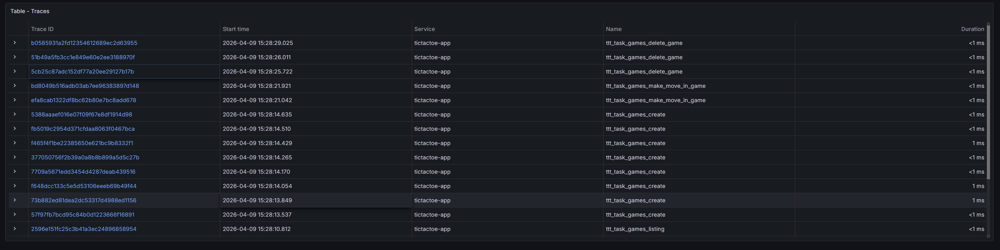
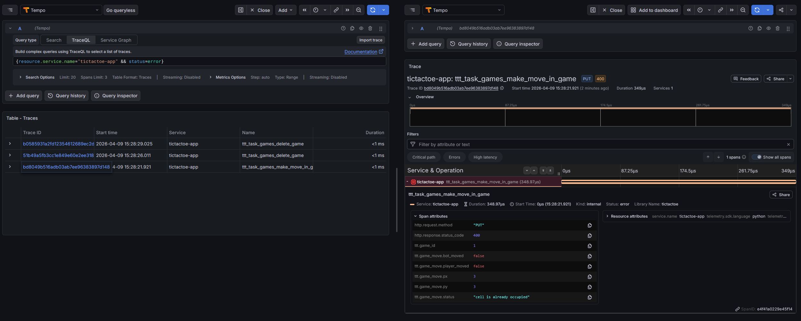

# Трейсы для сервиса на OpenAPI

Основа проекта: сгенерированный и минимально реализованный [сервис на OpenAPI с внедрёнными собственными метриками и логами](https://github.com/zavierwaffle/logs-tic-tac-toe).

Данный сервис - продолжение, с добавлением трейсов, реализованных через *OpenTelemetry*, используя проброс через *Grafana Tempo*.

## Трейсы

Все трейсы и аттрибуты описаны в файле реализации сервиса [`default_controller.py`](./openapi_tic_tac_toe/controllers/default_controller.py).

Примеры некоторых трейсов:

| Название трейса                      | HTTP-endpoint            |
|:-------------------------------------|:-------------------------|
| **ttt_task_games_delete_game**       | `DELETE /games/${GameId}`|
| **ttt_task_games_make_move_in_game** | `PUT /games/${GameId}`   |
| **ttt_task_games_listing**           | `GET /games`             |

Примеры некоторых аттрибутов:

| Название аттрибута             | Назначение                                                       |
|:-------------------------------|:-----------------------------------------------------------------|
| **http.request.method**        | Метод HTTP-запроса                                               |
| **http.response.status_code**  | Код возврата HTTP-запроса                                        |
| **ttt.game_created_id**        | Идентификатор новой (создано через `PUT /games`) игры            |
| **ttt.game_move.player_moved** | Индикатор, сделал ли ход игрок с запросом `PUT /games/${GameId}` |
| **ttt.game_prev_active_total** | Предыдущее количество активных (не завершённых) игр              |

Во всех примерах `${GameId}` - это подстановка значения переменной *данной* игры.

## Сборка и запуск

Поднять сервис:

```bash
docker-compose up -d
```

Занятые порты:

| Сервис                 | Порт |
|:-----------------------|:----:|
| `tictactoe-app`        | 8080 |
| `tictactoe-prometheus` | 9090 |
| `tictactoe-grafana`    | 3000 |
| `tictactoe-alloy`      | -    |
| `tictactoe-loki`       | 3100 |
| `tictactoe-tempo`      | 3200 |

Доступность относительно `localhost`:

| Адрес                                                     | Сущность   | Коммантерий                               |
|:----------------------------------------------------------|:-----------|:------------------------------------------|
| [`localhost:8080/ui`](http://localhost:8080/ui)           | Swagger UI | API сервиса                               |
| [`localhost:8080/metrics`](http://localhost:8080/metrics) | Метрики    | Технические и собственные метрики сервиса |
| [`localhost:9090`](http://localhost:9090)                 | Prometheus | Сервис запросов                           |
| [`localhost:3000`](http://localhost:3000)                 | Grafana    | Сервис дашбордов                          |
| [`localhost:3100/metrics`](http://localhost:3100/metrics) | Loki       | Техническая информация сервиса (метрики)  |
| [`localhost:3200/metrics`](http://localhost:3100/metrics) | Tempo      | Техническая информация сервиса (метрики)  |

*Примечание*. В Grafana по умолчанию имя пользователя и пароль: `admin`.

## Скриншоты




